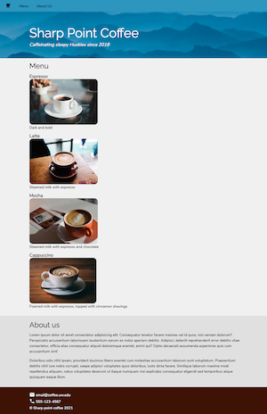

# Problem: Sharp Point Coffee

In this exercise, ou will practice applying CSS rules and properties to style a web page. You will work with fonts, colors, sizing, layout (margins & padding), and a number of other common properties.

To complete the exercise, add rules to the included `css/style.css` file in order to style the included `index.html` page (for a fictional coffee shop menu). In this end, the web page will look something like this:

Instructions for achieving this appearance are detailed below, though you'll also want to reference the above image for what it should look like. Note that you will need to edit both the CSS **and** the HTML for some effects.

**A note on testing**: while there are multiple approaches to achieving the desired effect, the unit tests are written to check for a particular (usually "best practice") implementation. This limitation is due to the need for automated testing, rather than any fault in other approaches.

1. The first thing you should do is set your page's [`box-sizing`](https://info340.github.io/css-layouts.html#box-sizing) to be `border-box`. This will help with calculating measurements of the rest of the changes (and is a good idea for all CSS you write!)

2. Add rules to establish the page's fonts:

    - The font for the whole body of the document will be `"Nunito Sans"` at a size of `16px`, with `Arial` and `sans serif` as fallback fonts. All headings (h1, h2, etc.) will have the font `"Raleway"` with a "light" weight of `300`, with `Helvetica` and `sans serif` as fallback fonts.

        - In order to include both the "Nunito Sans" and "Raleway" fonts, you will need to add a `<link>` to your HTML to reference them from [Google Fonts](https://fonts.google.com/). You can include both fonts via a single `<link>`. (Do not also include the "preconnect" links). Be sure to put this link _before_ your `css/style.css` link so that the fonts will be available for your CSS rules! Be sure to get the correct weight of "light" for the headings!

    - Top-level headings will have a font-size of `3.5` times the size of the root element font (so using the `rem` unit), and second-level headings will have a font-size of `2` times the size of the root element font.

    - There are a number of "icons" used in the page (the coffee cup in the navbar, and the email and phone icons in the footer). You can turn the included text into icons by using Google's [Material Design icon font for the web](https://google.github.io/material-design-icons/#icon-font-for-the-web). To do this, you'll need to include _another_ font from Google Fonts, this time for the "Material Icons" font. Including this font will automatically convert the elements with the `.material-icons` class into icons instead of text!

        - In order to make the icons better line up with their surrounding text, give them a [relative position](https://developer.mozilla.org/en-US/docs/Web/CSS/position) that is `5px` below the `top` of their normal placement in the content flow. This is one of the few legitimate cases in which you would use the `position` property.

3. Add rules to set up some general spacing. Note that you may need to modify previous rules to add more properties which apply to the same elements!

    - Each `.container` element (containing the content) will need to have a _maximum width_ of `960px`. Additionally, give each of those elements a `margin-left` and `margin-right` value of `auto`. This will cause the container to act as a single "column" of content centered within the page, no matter how wide the browser gets.

        - Additionally, `.container` elements have padding all around equal to the height of the root element font. Specify this padding with a single property.

    - Headings have no margin on the top (a margin of `0`), but have `.5rem` margins on the bottom

    - Paragraphs and _descriptive lists_ (the major content elements) should also have no margin on the top, but have `1rem` margin on the bottom.

4. The **navigation bar** (the `nav` element) has its own slightly complex set of styling in addition to the general rules listed above.

    - The navbar needs to have its [position](https://developer.mozilla.org/en-US/docs/Web/CSS/position) `fixed` to the top-left corner of the screen, and a `width` that spans `100%` of its parent element (so it goes across the whole page). This is one of the few legitimate cases in which you would use the `position` property.

    - The navbar has `white` text on a background colored `#2c96bf` (a light blue). It has`.5rem` of _padding_ all around, except for the bottom which has `1rem` of padding instead.

    -  The _list_ of hyperlinks inside of the navbar has no (`0`) additional margin or padding around it. The _list items_ in this list are [`inline`](https://developer.mozilla.org/en-US/docs/Web/CSS/display) (instead of the default block display). Each list item has `0` margin on the top and bottom, but `1rem` margins on the sides. Use a _shorthand_ property to specify the margins for the list items using a single property declaration with only 2 values (one for top/bottom, and one of left/right).

    - The hyperlinks inside of the navbar's list are colored `black`, and are [not underlined](https://developer.mozilla.org/en-US/docs/Web/CSS/text-decoration).

        - However, when you _hover_ or _focus_ (or _activate_) these hyperlinks, their color should change to `#f0f0f0` (a very very light gray), and should be given a bottom border of the same color that is `.8rem` thick. This will cause them to _look_ like they are underlined when you hover over them, indicating that they can be clicked. (You may need to delcare this rule at the bottom of the file to meet the linter's style requirements).

        - Optionally, also include a [transition](https://developer.mozilla.org/en-US/docs/Web/CSS/transition) to animate the color changing and the border appearing. I used a `.25s` transition with an `ease-out` easing function, which almost makes it look like the underlining is "pouring" out of the link when you hover over it!

        Note that these colors must _only_ apply to the hyperlinks in the navbar, not to hyperlinks anywhere else on the page!

5. The **header** is unique on the page in that it has a background image (some misty mountains).

    - All text in the header is colored `white`. 
    
    - The motto paragraph ("Caffeinating sleepy Huskies since 2018") should be in [italics](https://developer.mozilla.org/en-US/docs/Web/CSS/font-style), and 1.25x the size of the root element's height.

    - The header will need a lot of padding on the top to make sure its content isn't hidden behind the fixed navbar. Give it 6x the root element's height as top padding. It should also have the root element's height worth of padding on the bottom.

    - The header will have a [background image](https://info340.github.io/css-options.html#backgrounds-and-images). This image will be the `paul-gilmore-145802-unsplash.jpg` file found in the `img` folder (file is taken from [Unsplash](https://unsplash.com/) and named as such). Note that a CSS `url()` is _relative to the location of the stylesheet_, so you'll need to include a (relative) path indicating how to get to the background image file.

        The background image needs to be sized to `cover` the element, and centered in that element. Also give the element a background color of `#0084af` (just in case the image fails to load). Do not use a shortcut property for these settings to help be explicit about your styling and to enable the automated testing.

6. The menu section has some specific styling as well:

    - This section has a background color of `#f0f0f0` (a very very light gray). Note that you need to color the entire section and not just the `container` so that the background color stretches across the whole page.

    - The content of the menu section is a [descriptive list](https://developer.mozilla.org/en-US/docs/Web/HTML/Element/dl). 
        - Each _term_ in the descriptive list (the menu item headings) has a font size of 125% the root element's height, is [bold](https://developer.mozilla.org/en-US/docs/Web/CSS/font-weight), and has `1rem` of margin on the top to spread it away from other items.
        - Each _definition_ in the descriptive list should have no (`0`) margin.

    -  The images in the menu section should have a fixed height of `200px`. Additionally, give each image [rounded corners](https://developer.mozilla.org/en-US/docs/Web/CSS/border-radius), with each corner rounded by `15px`.

7. The about section is mostly styled through the general styling described above.

    - This section has a background color of `#e0e0e0` (a light grey). 

    - Additionally, give the content in this section a [line-height](https://developer.mozilla.org/en-US/docs/Web/CSS/line-height) of 1.5x its font height. Note that `line-height` takes a _unitless_ value (it's a multiplier!)

8. The footer is the last part, but it has a couple of specific styling needs:

    - The content in the footer section is `white`, and the footer's background color is `#3e1305` (a coffee brown). Note that the footer's hyperlinks require their own specific styling; they are also `white` and are [not underlined](https://developer.mozilla.org/en-US/docs/Web/CSS/text-decoration).

    - Unlike the rest of the document, the paragraphs in the footer should have no (`0`) margin, and a line-height of 1.25x its font height. The very _last_ paragraph in this section though should have `8px` of padding on the top to help spread it out from the icons in the previous lines. Use a pseudoclass selector to apply this styling to the last `p` in the footer.
