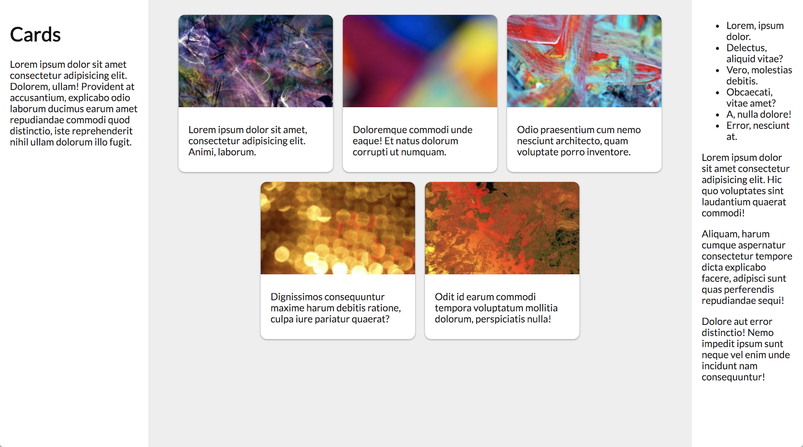

# Problem: Flexbox

In this exercise, you'll practice working with CSS "containers" and the Flexbox framework to make complex layouts.

To complete the exercise, you will need to modify the provided `index.html` and `css/style.css` files in order to layout the content as columns of [cards](https://material.io/guidelines/components/cards.html):

Instructions for achieving this appearance are detailed below. Note that you will need to edit both the HTML _and_ the CSS file (styling involves both semantic structure and style rules!). I have already provided some simple formatting (fonts, etc.) to get you started.

1. Each `<section>` should be its own column in a _three-column_ layout. Use the Flexbox framework to create this structure.

    - As always, remember to specify your box-sizing (to be `border-box`) to make sure the measurements are correct!

    - Start by creating a `
` to act as the "container" (with `display: flex`) to hold the Flexbox. This `
` should be a child of the `<main>` element and contain as children the three `<section>` elements (e.g., it should "wrap" them).

    - Each `<section>` element should then be styled as a Flexbox item. The columns should be sized as follows:

    - The columns should be sized as follows:

        - The first section should have a [basis](https://css-tricks.com/snippets/css/a-guide-to-flexbox/#aa-flex-basis) size of `240px`. (A width relative to the browser would be more flexible but make it hard to isolate changes).
        - The second section should have a `basis` of `0` and [grow](https://css-tricks.com/snippets/css/a-guide-to-flexbox/#aa-flex-grow) to fill the remaining space. Use the `flex` shortcut property for this. 
        
            This column should have a background color of `#eee`.

        - The third section should have a base size of `180px`, but should _not_ grow or [shrink](https://css-tricks.com/snippets/css/a-guide-to-flexbox/#aa-flex-shrink) if the window gets small. (You can test this out by resizing the browser and confirming that the text doesn't reflow like it does in the first section). Use individual flex properties (not the `flex` shortcut property).

    - Additionally, give each column `1em` of padding on all sides so there is some space between the edges.

    You can use different CSS classes to style each column, but you should also think about using a _shared_ class for shared properties (such as the padding).

2. The images in the second (middle) section will need to be made into "cards". To do this, you will need to put inside that section _another_ Flexbox container, in which each card will be a Flexbox item.

    - Add another `
` inside the second `<section>` to act as _another_ Flexbox container (do not try to make the `<section>` itself into a Flexbox container). This new container should contain _all_ of the content inside of that section.

    - The container should specify that if the cards (items) can't fit onto a single line, they should [wrap](https://css-tricks.com/snippets/css/a-guide-to-flexbox/#aa-flex-wrap) to the next.

    - [Justify](https://css-tricks.com/snippets/css/a-guide-to-flexbox/#aa-justify-content) the card items inside the container so that they match the sample image.

    - Each card contains both an image and text. Add `
` elements to "group" (wrap) the content (image and paragraph "description") into a Flexbox item&mdash;the "card.

    - Each card should have a base size of `250px` (the same size as the image), and should neither grow nor shrink based on the available space. Use the `flex` shortcut property to declare this.

    - Give each card a white background and add `.5rem` of spacing between them (on all sides).

3. The next step is to style the cards, giving them some spacing, (subtle) rounded corners, and a drop-shadow!

    - The text content of the cards should have and additional `1rem` of space on the left and right, and `.5rem` of space on the top and bottom. However, there should be _no_ space between the image and the edge of the cards. This means you will need to style the text and not the "card" `
`. Use a shortcut property!

    - Each card should have [rounded corners](https://developer.mozilla.org/en-US/docs/Web/CSS/border-radius), with a radius of `10px` on all 4 sides. 
    
        Because the image at the top of the card is flush wit its edge, it will _also_ need to have rounded corners... but only on the top of the image&mdash;the bottom of the image should be flat with the text content. Use multiple property values (similar to padding, margin, and border) to specify different radii for different corners.

    - Finally, create a shadow effect by adding _two_ [drop-shadows](https://developer.mozilla.org/en-US/docs/Web/CSS/box-shadow?v=b) to the card. The two shadows will be interpolated to create a single effect&mdash;use a comma-separated list of values to specify them.

        Each shadow should have an `x-offset` of `0`, a `y-offset` of `1px`, and a `blur-radius` of `3px`. The first shadow should be black with a <a href="https://developer.mozilla.org/en-US/docs/Web/CSS/color_value/rgba()">transparency alpha</a> of `.16`, and the second should be black with an alpha of `.23`. (These numbers are adapted from examples, hence the odd specificity).

4. If your window is big enough, you may have noticed that the center column's gray background doesn't always stretch all the way to the bottom. In fact, it only goes as far down as the content of the "outer" flexbox (which is usually the size of the text-heavy third column). It is possible to fix this by using&mdash;you guessed it!&mdash;another Flexbox!

    - To do this, you will need to make the _entire body_ into a Flexbox container (but in the `column` direction!) that contains a single Flex item: the `<main>` content of the page. That item should have a grow factor of `1` so it fills up the remaining space in the page (use the `flex` shortcut property so it has the proper defaults)!

    - However, you'll also need to make sure that the columns actually fill the height of the screen. To do this, you need to give a `height: 100%` property to the root `<html>` element, and give the `<body>` have `height` property that will `inherit` from the parent. Finally, you'll _also_ need to give the Flexbox container `
` you created in Step 1 a `height: 100%` so that it knows to fill up its parent (the `<main>` tag, which will you've specified will grow to fill the body!)

_Images from <http://lorempixel.com/>._